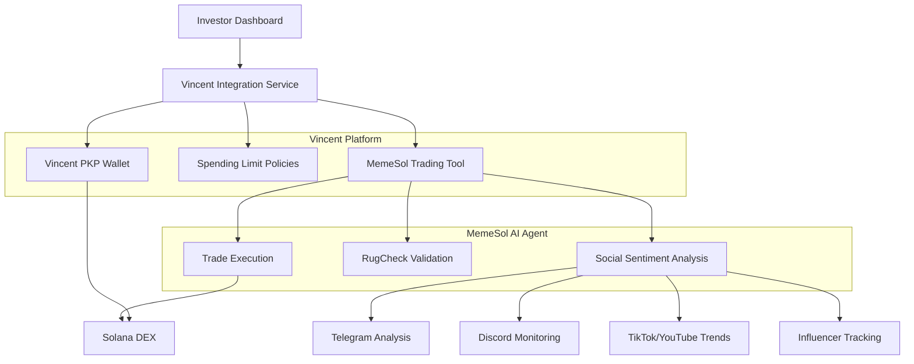

# 🤖 Vincent.ai Integration for MemeSol Trading Agent

This document explains how investors can use the HeyVincent.ai platform to invest in our autonomous memecoin trading agent with customizable policies and encrypted wallet management.

## 🌟 Features

### For Investors
- **🛡️ Secure Wallet Management**: Vincent provides encrypted wallet access with PKP (Programmable Key Pairs)
- **📋 Custom Trading Policies**: Set spending limits, risk exposure, and trading parameters
- **⏰ Scheduled Transactions**: Automated trading with time-based controls
- **🛑 Emergency Controls**: Instant stop-loss and emergency shutdown capabilities
- **📊 Real-time Monitoring**: Track performance and adjust policies on-the-fly

### For the AI Agent
- **🎯 Advanced Social Sentiment**: Multi-platform analysis (Telegram, Discord, TikTok, YouTube, Twitter)
- **🔍 Comprehensive Risk Assessment**: RugCheck integration with detailed scoring
- **⚡ Rate-Limited API Calls**: Enterprise-grade request management
- **🚀 Autonomous Execution**: Self-managing trade execution with policy compliance

## 🏗️ Architecture



## 🚀 Getting Started

### 1. Investor Onboarding

1. **Visit the Investor Dashboard**: Navigate to `/investor` on our platform
2. **Review Agent Performance**: Check historical metrics, win rate, and ROI
3. **Configure Investment Session**: Set your trading policies and limits
4. **Connect Vincent Wallet**: Create or connect your Vincent PKP wallet
5. **Start Investing**: Activate your session and let the AI trade for you

### 2. Policy Configuration

#### Spending Limits
```typescript
{
  dailyLimit: 1.0,        // Maximum 1 SOL per day
  weeklyLimit: 5.0,       // Maximum 5 SOL per week  
  monthlyLimit: 20.0,     // Maximum 20 SOL per month
  maxPositionSize: 0.5,   // Maximum 0.5 SOL per trade
}
```

#### Risk Management
```typescript
{
  maxRiskExposure: 0.3,           // Max 30% in high-risk tokens
  minAgentScore: 40,              // Minimum agent confidence score
  allowedRiskCategories: ['low', 'moderate'], // Allowed risk levels
  emergencyStop: false,           // Emergency stop switch
}
```

#### Whitelisting/Blacklisting
```typescript
{
  whitelist: ['token1...', 'token2...'], // Only trade these tokens
  blacklist: ['scam1...', 'rug1...'],   // Never trade these tokens
}
```

## 🔧 Technical Implementation

### Vincent Tools Created

#### 1. MemeSol Trading Tool (`memesol-trading-tool.ts`)
- **Purpose**: Execute autonomous memecoin trades with risk management
- **Features**: 
  - Multi-source data validation
  - Social sentiment integration
  - Automated stop-loss/take-profit
  - Policy compliance checking

#### 2. Spending Limit Policy (`memesol-spending-policy.ts`)
- **Purpose**: Enforce investor-defined spending and risk limits
- **Features**:
  - Daily/weekly/monthly spending caps
  - Risk exposure controls
  - Agent score requirements
  - Emergency stop functionality

### API Endpoints

#### Create Investment Session
```typescript
POST /api/vincent/create-session
{
  "walletAddress": "0x...",
  "settings": {
    "dailyLimit": 1.0,
    "weeklyLimit": 5.0,
    // ... other settings
  }
}
```

#### Execute Trade
```typescript
POST /api/vincent/execute-trade
{
  "sessionId": "session_123",
  "tokenAddress": "token_address",
  "investmentAmount": 0.5,
  "maxSlippage": 0.05
}
```

#### Run Analysis + Auto-Trade
```typescript
POST /api/run-memesol-vincent
{
  "sessionId": "session_123",
  "autoInvest": true
}
```

## 📊 Social Sentiment Analysis

Our agent analyzes sentiment across multiple platforms:

### Telegram Analysis
- Member growth tracking
- Message sentiment scoring
- Spam/bot detection
- Community engagement metrics

### Discord Monitoring  
- Server activity analysis
- Community health scoring
- Moderation activity tracking
- Member retention analysis

### TikTok/YouTube Trends
- Viral content detection
- Hashtag performance
- Creator influence analysis
- Momentum scoring

### Influencer Tracking
- Major crypto influencer monitoring
- Sentiment impact analysis
- Call accuracy tracking
- Social buzz correlation

## 🛡️ Security Features

### Vincent Platform Security
- **PKP Wallets**: Non-custodial, programmable key pairs
- **Encrypted Storage**: All sensitive data encrypted at rest
- **Policy Enforcement**: Immutable spending and risk controls
- **Audit Trail**: Complete transaction and decision logging

### Rate Limiting
- **API Protection**: Comprehensive rate limiting for all social APIs
- **Batch Processing**: Intelligent request batching and spacing
- **Error Handling**: Robust retry mechanisms with exponential backoff
- **Monitoring**: Real-time rate limit status tracking

## 🎯 Investment Strategies

### Conservative Strategy
```typescript
{
  dailyLimit: 0.5,
  maxPositionSize: 0.1,
  minAgentScore: 60,
  allowedRiskCategories: ['low'],
  maxRiskExposure: 0.1,
}
```

### Balanced Strategy  
```typescript
{
  dailyLimit: 2.0,
  maxPositionSize: 0.5,
  minAgentScore: 40,
  allowedRiskCategories: ['low', 'moderate'],
  maxRiskExposure: 0.3,
}
```

### Aggressive Strategy
```typescript
{
  dailyLimit: 5.0,
  maxPositionSize: 1.0,
  minAgentScore: 25,
  allowedRiskCategories: ['low', 'moderate', 'high'],
  maxRiskExposure: 0.6,
}
```

## 📈 Performance Metrics

Track your investment performance with detailed metrics:

- **Total ROI**: Overall return on investment
- **Win Rate**: Percentage of profitable trades
- **Sharpe Ratio**: Risk-adjusted returns
- **Max Drawdown**: Largest peak-to-trough decline
- **Average Hold Time**: Typical position duration
- **Social Sentiment Accuracy**: Correlation between sentiment and performance

## 🚨 Risk Warnings

### Investment Risks
- **High Volatility**: Memecoins are extremely volatile
- **Total Loss**: You may lose your entire investment
- **Market Risk**: Crypto markets can crash rapidly
- **Technical Risk**: Smart contracts may have bugs

### Mitigation Strategies
- **Start Small**: Begin with minimal amounts
- **Diversify**: Don't put all funds in one strategy
- **Monitor Actively**: Check performance regularly
- **Use Stop-Losses**: Set appropriate risk limits
- **Emergency Controls**: Keep emergency stop accessible

## 🔧 Development Setup

To integrate with Vincent in your development environment:

1. **Install Dependencies**:
   ```bash
   npm install @lit-protocol/vincent-tool-sdk zod
   ```

2. **Configure Environment**:
   ```bash
   VINCENT_API_URL=https://api.heyvincent.ai
   VINCENT_API_KEY=your_api_key
   ```

3. **Deploy Tools**:
   ```typescript
   import { memesolTradingTool } from './vincent/memesol-trading-tool';
   // Deploy to Vincent platform
   ```

## 🆘 Support & Emergency

### Emergency Procedures
1. **Emergency Stop**: Click the emergency stop button in your dashboard
2. **Contact Support**: Use the support chat for urgent issues
3. **Manual Override**: Access your Vincent wallet directly if needed

### Getting Help
- **Documentation**: Read the full Vincent.ai documentation
- **Community**: Join our Discord for community support  
- **Support Tickets**: Submit tickets for technical issues

## 📚 Additional Resources

- [Vincent.ai Documentation](https://docs.heyvincent.ai/)
- [Vincent Tool Creation Guide](https://docs.heyvincent.ai/documents/Creating_Vincent_Tools.html)
- [Spending Limit Policy Examples](https://github.com/LIT-Protocol/Vincent/tree/main/packages/apps/policy-spending-limit)
- [ERC20 Approval Tools](https://github.com/LIT-Protocol/Vincent/tree/main/packages/apps/tool-erc20-approval)

---

**⚠️ Disclaimer**: This is an experimental trading system. Cryptocurrency investments carry significant risk. Only invest what you can afford to lose.
